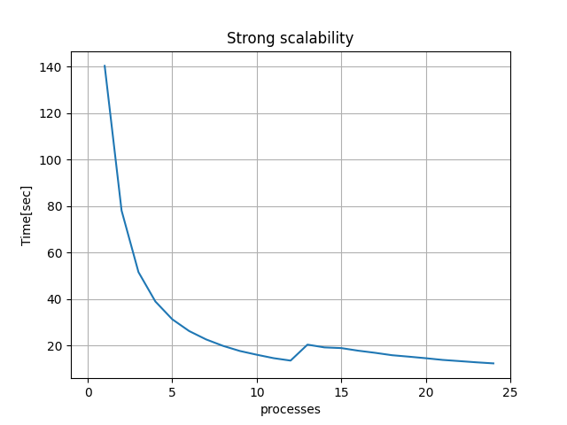

# N-body

---

Progetto di Programmazione Parallela Concorrente e su Cloud

Nome: Antonello
Cognome: Luppolo

---

## Sommario
- [N-body](#n-body)
  - [Sommario](#sommario)
  - [Introduzione](#introduzione)
  - [Descrizione soluzione proposta](#descrizione-soluzione-proposta)
  - [Dettagli implementativi](#dettagli-implementativi)
    - [Definizione del tipo body](#definizione-del-tipo-body)
    - [Distribuzione del carico di lavoro](#distribuzione-del-carico-di-lavoro)
    - [Inizializzazione porzione di particelle](#inizializzazione-porzione-di-particelle)
    - [Fase  di simulazione](#fase--di-simulazione)
  - [Istruzioni per l'esecuzione](#istruzioni-per-lesecuzione)
  - [Correttezza del programma](#correttezza-del-programma)
  - [Discussione dei risultati](#discussione-dei-risultati)
    - [Strong scalability](#strong-scalability)
    - [Weak scalability](#weak-scalability)
  - [Conclusioni](#conclusioni)
  
---

## Introduzione

  In generale il problema N-body consiste nel prevedere il moto (posizione e velocità) di un gruppo di N-oggetti che interagiscono indipendentemente l'uno dall'altro, sotto l'influenza di forze fisiche, come ad esempio la  forza di gravità. Molti fenomeni fisici, astrofisici e chimici, possono essere simulati con un sistema di particelle in cui ogni particella interagisce con le altre secondo leggi fisiche.
  Per studiare questi fenomeni vengono utilizzati programmi che simulano il comportamento delle particelle. Tali programmi in:

- **input** prendono un insieme di particelle, dove per ognuna viene specificata la sua posizione nello spazio e la sua velocità all'inizio della simulazione;
- **output** restituiscono la posizione e velocità di ciascuna particella alla fine della simulazione.

Per simulare il comportamento di n corpi sono stati implementati diversi algoritmi con diversi gradi di complessità e approssimazione. Tra questi prendiamo in considerazione il codice realizzato da Mark Harris, reperibile al seguente link: [mini-nbody](https://github.com/harrism/mini-nbody). Si tratta di un programma scritto in linguaggio C che:

- esegue la simulazione su un numero di particelle che può essere specificato dall'utente tramite riga di comando, oppure su un numero predefinito di particelle, nel caso in cui non venisse fornito alcun input.
- tramite un algoritmo pseudocasuale vengono inizializzati i campi di ogni particella
- la simulazione prevede 10 iterazioni dove ad ognuna:
  - si tiene traccia del tempo di inizio dell'iterazione
  - in maniera sequenziale ogni particella viene confrontata con tutte le altre per calcolare la forza e la posizione che assumerà all'iterazione successiva
  - viene stampato sullo standard output il tempo impiegato per il completamento dell'iterazione i-esima
- in fine viene stampato, sempre su standard output, il rapporto iterazioni/secondo.

La soluzione fornita da tale programma è quadratica nel numero di particelle.
È possibile ottimizzare tale codice utilizzando la libreria OpenMPI, in modo da parallelizzare il calcolo.

## Descrizione soluzione proposta

Di seguito viene mostrata una versione ottimizzata del programma sopra citato che fa uso della libreria OpenMPI, mediante la quale si va a distribuire il calcolo della forza delle particelle tra n processi nel seguente modo:

- nella soluzione proposta i processi comunicano tra di loro attraverso il communicator MPI_COMM_WORLD. All'interno del gruppo associato a questo communicator i processi vengono distinti in base al loro rank in due "categorie":
  - MASTER: un solo processo appartiene a questa categoria e viene identificato con rank = 0;
  - SLAVE: tutti gli altri invece appartengono a quest'altra categoria ed hanno rank > 0;
- tutti i processi contribuiscono alla computazione.

- la simulazione viene fatta su un numero preciso di particelle se tale valore viene specificato dall'utente tramite riga di comando. Altrimenti viene fatta su un numero predefinito di particelle, indicato all'interno del programma.
- ciascun processo esegue il calcolo per la distribuzione del carico di lavoro e cioè calcola la propria porzione di particelle e quella degli altri processi.
- Dopodiché inizializza la sua porzione di particelle.
- Procede con la simulazione, la quale prevede 10 iterazioni, dove in ciascuna, ogni processo:  
  1) invia la propria porzione di particelle a tutti gli altri n-1 processi utilizzando una comunicazione collettiva non bloccante;
  2) sempre tramite operazioni di comunicazioni collettive non bloccanti resta in attesa che tutti gli altri processi gli inviino la loro porzione;
  3) durante questa fase di comunicazione inizia il calcolo della forza di ciascuna particella della sua porzione. Ovvero per calcolare una "parte della forza" di ogni particella, fa interagire ciascuna particella della sua porzione con tutte le altre al suo interno.
  4) non appena riceve una o più porzioni continua il calcolo della forza delle proprie particelle, utilizzando quelle appena ricevute. Ovvero fa interagire ciascuna particella della sua porzione con quelle ricevute, andando poi ad aggiornare il valore intermedio della sua forza.
  5) terminate le fasi di ricezione e calcolo della forza, il processo può proseguire con l'aggiornamento dei valori(forza e posizione) della propria porzione di particelle. Tale risultato è necessario per il prossimo passo della simulazione. Ma arrivati a questo punto il processo disporrebbe già della porzione necessaria sulla quale lavorare alla prossima iterazione. Dunque sia il MASTER sia gli SLAVE, prima di procedere con l'aggiornamento dei valori verificano se la richiesta relativa all'invio della propria porzione(punto 1.) è stata completata. Nel caso in cui la richiesta è ancora in fase di completamento il processo va a scrivere i risultati in un secondo buffer di invio, il quale verrà usato nel prossimo passo della simulazione. Inoltre c'è da tener presente che quando ciò accade all'iterazione successiva viene utitizzata una richiesta diversa dalla precedente. Questo comporta che dalla seconda iterazione in poi il processo, nel caso in cui la richiesta "corrente" di invio della sua porzione non è stata ancora completata, deve controllare che quella precedente sia terminata per poter scrivere nell'altro buffer. Altrimenti il processo si mette in attesa che la richiesta precedente venga completata, per poi proseguire con l'aggiornamento e la scrittura dei risultati nel buffer corrispondente. In tutti gli altri casi se la richiesta "corrente" relativa all'invio della sua porzione è stata completata riusa lo stesso buffer sul quale stava già lavorando e la stessa richiesta anche per l'interazione successiva.
  Questo viene fatto per permettere al processo di proseguire il lavoro evitando inutili attese.
  6) Se il processo in esecuzione è il MASTER, quest'ultimo, stampa a video il tempo impiegato per il completamento dell'iterazione i-esima e passa alla prossima iterazione. Altrimenti se il processo è uno SLAVE passa direttamente alla prossima iterazione.
- Al termine della simulazione il processo MASTER stampa sullo standard output il rapporto iterazioni/secondo.

## Dettagli implementativi

### Definizione del tipo body
Le particelle vengono rappresentate tramite delle strutture C così definite:

```C
typedef struct { float x, y, z, vx, vy, vz; } Body;
```

Ma visto che ogni particella è una sestupla di float, dove ciascuna di esse rappresenta rispettivamente la sua posizione nello spazio(x, y, z) e la forza(vx, vy, vz), è possibile dichiarare un array di particelle nel modo sottostante (così come viene fatto anche nel programma di partenza):

```C
  int bytes = nBodies * sizeof(Body);
  float *buf = (float *)malloc(bytes);
  Body *p = (Body *)buf;
```

La dichiarazione dell'insieme di particelle come un array di float e non come un array di struct permette di evitare l'uso di tipi di dati derivati in MPI. Ciò consente di risparmiare l'esecuzione di altro codice per la gestione delle struct nelle fasi precedenti e successive a quelle della loro trasmissione e ricezione. Dunque i processi inviano e ricevono porzioni di particelle come array di float e tramite un puntatore a Body si accede alla particella i-esima.

### Distribuzione del carico di lavoro

```C
  ...
  // CALCULATE WORKLOAD DISTRIBUCTION
  int portion = nBodies / n_workers;
  int rest = nBodies % (n_workers);
  int proc_portion_size[n_workers];
  int proc_portion_start[n_workers];
  calculatePortions(proc_portion_size, proc_portion_start, n_workers, portion, rest);
  ...
```

Indichiamo con *n_workers* il numero di processi che contribuiscono al calcolo della forza delle particelle.
Come accennato nella sezione precedente, ogni processo contribuisce alla computazione e il processo MASTER, in più rispetto agli altri tiene traccia del tempo impiegato dall'iterazione i-esima della simulazione e stampa a video tali informazioni. Il motivo per il quale è stata fatta tale scelte deriva dal fatto che: il tempo necessario per l'iterazione i-esima, in cui il master oltre a partecipare al calcolo della forza delle particelle esegue anche le operazioni appena dette, è minore in confronto ad una nella quale il MASTER non contribuisce al calcolo della forza, ma riceve solo i risulati e tiene solo traccia del tempo facendone la stampa a video. Poichè gli altri n-1 processi avrebbero più carico di lavoro e il processo MASTER resterebbe in stato di hidle fino al ricevimento dei risultati per poi per poi notificare il tempo impiegato dai processi per il calcolo mentre essi già hanno iniziato l'iterazione successiva. Dunque il tempo complessivo del programma in cui il MASTER "non lavora" è maggiore rispetto a quando esso contribuisce al calcolo della forza. Ecco perchè in questo caso specifico conviene che tutti i processi contribuiscano al calcolo.
Il numero di particelle viene diviso tra gli n processi andando a dividere la taglia dell'input per il numero di n_workers. Una volta calcolata la porzione che dovrà essere assegnata a ciascun processo e l'eventuale resto, vengono allocati gli array proc_portion_size[] e proc_portion_start[]. Questi array servono per tener traccia delle porzioni di ciascun processo per la fase di invio e ricezione delle altre particelle(questo aspetto verrà approfondito in più avanti, quando verrà trattata la fase di invio e ricezione tramite le chiamate collettive MPI_Ibcast). Dopodichè viene fatto il calcolo delle porzioni da assegnare a ciascun processo come mostrato di seguito

```C
void calculatePortions(int proc_portion_size[], int proc_portion_start[], int n_workers, int portion, int offset)
{
    proc_portion_size[0] = portion;
    proc_portion_start[0] = 0;

    int i, j;

    if (offset > 0)
    {
        int i, j;
        for (i = 1, j = 0; j < offset; i++, j++)
        {
            proc_portion_size[i] = portion + 1;
            proc_portion_start[i] = portion * i + j;
        }
        for (; i < n_workers; i++, j++)
        {
            proc_portion_size[i] = portion;
            proc_portion_start[i] = portion * i + offset;
        }
    }
    else
    {
        for (int i = 0, j = 0; i < n_workers; i++, j++)
        {
            proc_portion_size[i] = portion;
            proc_portion_start[i] = portion * j;
        }
    }
}
```

Se il numero di particelle non è divisibile per il numero di processi, il resto delle particelle viene distribuito a partire dal 2° processo (il cui rank = 1) in poi. Cioè viene assegnata una particella in più, delle restanti, a tali processi. Ciò viene fatto perché in questo caso è possibile "alleggerire" il carico di lavoro del processo MASTER poiché, come già detto, a differenza dei processi SLAVE, fa alcune operazioni in più. Altrimenti le particelle vengono distribuite equamente tra gli n processi. Per ogni processo dunque viene calcolata la propria porzione e l'indice dal quale inizia il suo intervallo nell'array di particelle buf (descritto al punto precedente. C'è da notare che le porzioni e gli indici di inizio di queste ultime non vengono moltiplicati per 6. Questo perché, come già spiegato, è possibile tramite un puntatore a Body accede all'i-esima particella all'interno di buf.

### Inizializzazione porzione di particelle

```C
  // DEFINE VARIABLES FOR WORKLOAD INTERVALS
  int own_portion = proc_portion_size[worker_rank];
  int start_own_portion = proc_portion_start[worker_rank];
  int start = start_own_portion;
  int end = start + own_portion;
  float Fx[own_portion];
  float Fy[own_portion];
  float Fz[own_portion];
  // INIT OWN BODY PORTION 

```

Vengono definite delle "variabili di processo", ovvero variabili che servono al processo in esecuzione:

- *start* ed *end* per delineare l'intervallo della porzione di particelle, nell'array buf.
- *Fx*, *Fy*, *Fz* servono per tener traccia dei valori della forza delle particelle, durante i vari calcoli(tra le diverse invocazioni della funzione bodyForceSplit) con le altre particelle che vengono ricevute dagli altri processi(L'utilità di tali variabili verrà approfondita più avanti).

Ogni processo, una volta definito il proprio intervallo, inizializza le proprie particelle sulle quali deve lavorare. La fase di inizializzazione avviene tramite un algoritmo deterministico, ovvero utilizzando la funzione *determisticInitBodiesSplit*. A differenza del programma di partenza, che fa uso di un algoritmo che assegna valori alle particelle in maniera casuale, è stato utilizzato un algoritmo deterministico per poter valutare la correttezza del programma. Nel dettaglio la funzione utilizzata a tale scopo è la seguente:

```C
void determisticInitBodiesSplit(float *buf, int own_portion, int start_own_portion)
{
    Body *p = (Body *)buf;
    for (int i = 0; i < own_portion; i++)
    {
        p[start_own_portion + i].x = start_own_portion + i + 1;
        p[start_own_portion + i].y = start_own_portion + i + 1;
        p[start_own_portion + i].z = start_own_portion + i + 1;
        p[start_own_portion + i].vx = 0.0f;
        p[start_own_portion + i].vy = 0.0f;
        p[start_own_portion + i].vz = 0.0f;
    }
}
```

### Fase  di simulazione

```C
  // DEFINE REQUESTS FOR PORTIONS EXCHANGES
  MPI_Request bcast_recv[n_workers];
  MPI_Request bcast_send_prec = MPI_REQUEST_NULL;
  MPI_Request bcast_send_next = MPI_REQUEST_NULL;
  // DEFINE POINTER FOR PREC AND NEXT NONBLOCKING COMMUNICATION REQUESTS
  MPI_Request *bcast_pointer_next_req = &bcast_send_next;
  MPI_Request *bcast_pointer_prec_req = &bcast_send_prec;
  MPI_Request *tmp_bcast_send_req_swap = &bcast_send_prec;
  // DEFINE BUFFER FOR SEND AND NEW DATA WHILE PREC SEND REQUEST HAS NOT FINISHED
  float *buf_send = (float *)malloc(bytes);
  Body *p_send = (Body *)buf_send;
  // DEFINE TMP VARIABLES
  int i, j , bcast_send_done;
  Body *tmp_buf_swap;
  MPI_Request pending_allgath_req = MPI_REQUEST_NULL;
  // START i-th PROCES WORK
  for (int iter = 1; iter <= nIters; iter++)
  {
      if (worker_rank == MASTER)
          StartTimer();
      // PORTION EXCHANGE BETWEEN PROCESSES: SEND OWN PORTION TO OTHER PROCESSES
      for (i = 0, j = 0; i < worker_rank; i++, j++)
          MPI_Ibcast(&p[proc_portion_start[i]], proc_portion_size[i] * 6, MPI_FLOAT, i, MPI_COMM_WORLD, &bcast_recv[j]);
      // PORTION EXCHANGE BETWEEN PROCESSES: SEND OWN PORTION TO OTHER PROCESSES
      MPI_Ibcast(&p[proc_portion_start[i]], proc_portion_size[i] * 6, MPI_FLOAT, i, MPI_COMM_WORLD, bcast_pointer_next_req);
      // PORTION EXCHANGE BETWEEN PROCESSES: RECEIVE PORTION FROM OTHER PROCESSES
      for (i = worker_rank + 1; i < n_workers; i++, j++)
          MPI_Ibcast(&p[proc_portion_start[i]], proc_portion_size[i] * 6, MPI_FLOAT, i, MPI_COMM_WORLD, &bcast_recv[j]);
      // INIT BODYFORCE FOR ITERATION i
      for (int i = 0; i < own_portion; i++) { Fx[i] = 0.0f; Fy[i] = 0.0f; Fz[i] = 0.0f; }
      // BODY FORCE COMPUTATION : CALCULATION OWN PORTION
      bodyForceSplit(p, dt, own_portion, start_own_portion, start, end, Fx, Fy, Fz);
      // BODY FORCE COMPUTATION : WAIT OTHER PORTIONS FROM OTHER PROCESSES FOR CONTINUE OWN COMPUTATION
      waitSomeWork(bcast_recv, reqs_ranks_indices, reqs_ranks, n_workers - 1, worker_rank, p, Fx, Fy, Fz, proc_portion_size, proc_portion_start);
      // MASTER PRINT INCOMING RESULTS
      if (worker_rank == MASTER && iter > 1 && print_res == 1)
          printResults(p, nBodies);
      // WAITS FOR THE PREVIOUS REQUEST TO WRITE IN THE SEND BUFFER
      MPI_Test(bcast_pointer_next_req,&bcast_send_done, MPI_STATUS_IGNORE);
      if(bcast_send_done == 0)
      {
          MPI_Wait(bcast_pointer_prec_req, MPI_STATUS_IGNORE);
          prepereSendBuffer(p, p_send, own_portion, start_own_portion);
          // CALCULATION OF RESULT
          integratePositionSplit(p_send, dt, own_portion, start_own_portion, Fx, Fy, Fz);
          // SWAP BUFFER POINTERS FOR NEXT ITERATION
          tmp_buf_swap = p;
          p = p_send;
          p_send = tmp_buf_swap;
          // SWAP REQEUST POINTER FOR NEXT ITERATION
          tmp_bcast_send_req_swap = bcast_pointer_prec_req;
          bcast_pointer_prec_req = bcast_pointer_next_req;
          bcast_pointer_next_req = tmp_bcast_send_req_swap;
      }
      else
          integratePositionSplit(p, dt, own_portion, start_own_portion, Fx, Fy, Fz);
      
      // END i-th ITERATION
      if (worker_rank == MASTER)
      {
          tElapsed = GetTimer() / 1000.0;
          if (iter > 1)
              totalTime += tElapsed;
          printf("Iteration %d: %.3f seconds\n", iter, tElapsed);
      }
  }
  // WAIT LAST PENDING REQUEST RESULTS COMPLETITION AND PROCESES SEND ONLY LAST RESULT TO THE MASTER
  MPI_Gatherv(&p[start_own_portion], own_portion * 6, MPI_FLOAT, p_send, recvcounts, displs, MPI_FLOAT, MASTER, MPI_COMM_WORLD);

  if (worker_rank == MASTER && print_res == 1)
      printResults(p_send, nBodies); // stampiamo qui fuori perchè quando usciamo dal ciclo for la igather sta ancora lavorando e quindi qui dobbiamo stampare i risultati

  free(buf_send);
}

```

Qui ogni processo invia la propria porzione di particelle a tutti gli altri, e riceve le altre porzioni da tutti gli altri processi tramite la funzione collettiva non bloccante MPI_Ibcast. In questa fase si tiene traccia delle corrispondenti richieste di invio e ricezione. L'importanza del tener traccia di queste richieste, con particolare attenzione per quanto riguarda quella di invio, verrà chiarita in seguito.
Durante la fase di comunicazione il processo inizia a calcolare la forza delle proprie particelle. Come prima cosa si inizializzano gli array Fx, Fy, Fz. Lo scopo di tali array è memorizzare i "valori intermedi" della forza delle proprie particelle durante i vari calcoli (tra le varie invocazioni della funzione bodyForceSplit) con le altre che vengono ricevute. Dunque Fx, Fy, Fz si potrebbero pensare come a una sorta di "accumulatori temporanei" corrispondenti a ciascuna particella della porzione del processo, per calcolare la sua forza ad ogni iterazione. Fatto ciò, il processo è pronto ad iniziare il calcolo della forza della propria porzione invocando la funzione bodyForceSplit:

```C
void bodyForceSplit(Body *p, float dt, int own_portion, int start_own_portion, int start, int end, float Fx[], float Fy[], float Fz[])
{
  for (int i = 0; i < own_portion; i++)
  {
    for (int j = start; j < end; j++) // start = inizio nuova porzione da confrontare end = fine porzione da confrontare
    {
      float dx = p[j].x - p[start_own_portion + i].x;
      float dy = p[j].y - p[start_own_portion + i].y;
      float dz = p[j].z - p[start_own_portion + i].z;

      float distSqr = dx * dx + dy * dy + dz * dz + SOFTENING;
      float invDist = 1.0f / sqrt(distSqr);
      float invDist3 = invDist * invDist * invDist;

      Fx[i] += dx * invDist3;
      Fy[i] += dy * invDist3;
      Fz[i] += dz * invDist3;
    }
  }
}
```

La funzione bodyForeceSplit prende in input essenzialmente l'array di particelle tramite il parametro p (puntatore che punta all'array *buf*), un valore costante dt, la taglia della porzione del processo i-esimo (numero di particelle della sua porzione), l'indice dal quale inizia la sua porzione nell'array di particelle, l'inizio e la fine dell'intervallo (in *buf*) della nuova porzione da utilizzare per il calcolo, ed infine gli array che contengono i valori intermedi Fx, Fy, Fz.
Inizialmente il processo i-esimo invoca la funzione bodyForceSplit passando come parametri start ed end il proprio intervallo, ovvero i suoi indici di inizio e fine in *buf*. Dunque inizia a calcolare la forza di ciascuna particella della sua porzione, facendo "interagire" ciascuna particella con tutte quante le altre al suo interno. Dopodiché tramite la funzione wait_some_work , sotto riportata:

```C
void waitSomeWork(MPI_Request bcast_recv[], int request_rank_indices[], int requests_ranks[], int n_recv_req, int rank, Body *p, float Fx[], float Fy[], float Fz[], int proc_portion_size[], int proc_portion_start[])
{
  int ready_req = 0;
  int count = n_recv_req;
  int start, end;
  int req_compl;
  const float dt = 0.01f;
  int own_portion = proc_portion_size[rank];
  int start_own_portion = proc_portion_start[rank];

  MPI_Waitsome(n_recv_req, bcast_recv, &ready_req, request_rank_indices, MPI_STATUS_IGNORE);
  while (ready_req != MPI_UNDEFINED)
  {
      count -= ready_req;
      for (int i = 0; i < ready_req; i++)
      {
          req_compl = requests_ranks[request_rank_indices[i]];
          start = proc_portion_start[req_compl];
          end = start + proc_portion_size[req_compl];

          bodyForceSplit(p, dt, own_portion, start_own_portion, start, end, Fx, Fy, Fz);
      }
      MPI_Waitsome(n_recv_req, bcast_recv, &ready_req, request_rank_indices, MPI_STATUS_IGNORE);
  }
  
  for (int i = 0; i < count; i++)
  {
      req_compl = requests_ranks[request_rank_indices[i]];
      start = proc_portion_start[req_compl];
      end = start + proc_portion_size[req_compl];

      bodyForceSplit(p, dt, own_portion, start_own_portion, start, end, Fx, Fy, Fz);
  }

}
```

il processo i-esimo per completare il calcolo della forza ha bisogno delle altre porzioni degli n-1 processi. Quindi deve attendere il completamento delle richieste di ricezione. Il primo motivo per il quale si tiene traccia delle richieste di comunicazione è per far in modo che il calcolo continui man mano che le particelle vengono ricevute. Per far sì che ciò avvenga viene utilizzata la funzione MPI_Waitsome, la quale attende che almeno una delle operazioni associate agli handle attivi, nell'array di richieste, sia stata completata e restituisce nella variabile *ready_req* il numero di richieste(indicate nell'array *bcast_recv*) che sono state completate. Inoltre va a scrivere nell'array di indici (*request_rank_indices*), nelle posizioni da 0 a *ready_req*, i corrispondenti indici delle richieste completate. Per risalire al rank del worker relativo a ciascuna richiesta, ogni processo, prima di iniziare la simulazione, inizializza l'array requests_ranks.
Quando una richiesta è stata completata viene deallocata, e l'handle associato viene impostato a MPI_REQUEST_NULL. Se l'array di richieste (*bcast_recv*) non contiene handle attivi, la chiamata ritorna immediatamente restituendo in *ready_req* il valore MPI_UNDEFINED. Dunque la prima volta che viene chiamata MPI_Waitsome se ci sono ancora richieste che non sono state ancora completate si entra nel ciclo while. All'interno del ciclo viene decrementata la variabile *count*, la quale tiene traccia delle richieste che devono essere ancora completate. *count* ha un ruolo importante che a breve verrà chiarito. Poi si va a scorrere l'array degli indici delle richieste completate, dove per ognuna di queste, si va a calcolare l'intervallo di particelle (in *buf*) del processo corrispondente, sul quale andare ad invocare la funzione bodyForceSplit per riprendere il calcolo della forza delle particelle del processo in esecuzione. Terminato il calcolo intermedio utilizzando le particelle ricevute, viene invocata nuovamente la funzione MPI_Waitsome e tutto ciò viene iterato fin quando non ci sono più richieste attive e quindi fin quando l'ultima MPI_Waitsome restituisce in *ready_req* il valore MPI_UNDEFINED. Ma quando si esce dal *while* non sono state ancora utilizzate le ultime particelle ricevute! È qui che si nota l'utilità della variabile *count*, la quale ha un duplice scopo. Il primo è quello di andare appunto a completare il calcolo della forza utilizzando le ultime particelle ricevute tramite il ciclo *for*, il quale non fa altro che scorrere l'array di richieste completate e invocare la funzione bodyForceSplit sull'intervallo del processo corrispondente. L'altro motivo è che se la prima volta che viene invocata la MPI_Waitsome (prima di entrare nel *while*), se tutte le richieste sono state completate, il valore restituito in *ready_req* sarà MPI_UNDEFINED. Per cui non si entrerà nel ciclo *while* e di conseguenza le particelle ricevute "associate a queste richieste" non verrebbero utilizzate. Ecco perché all'inizio il valore *count* viene posto uguale al numero di richieste da aspettare, il quale viene passato in input alla funzione(parametro *n_recv_req*). Così facendo tramite lo stesso ragionamento di prima e cioè tramite lo stesso ciclo *for*, sopra descritto, vengono utilizzate le particelle ricevute.
Una volta che il processo i-esimo ha ricevuto tutte le restanti porzioni ed ha terminato il calcolo della forza delle proprie particelle, esce dalla funzione waitSomeWork ed è pronto per aggiornare i loro valori(posizioni e forza) tramite la funzione integratePosition: 

```C
void integratePosition(Body *p, float dt, int nBodies)
{
    for (int i = 0; i < nBodies; i++) // integrate position
    {
        p[i].x += p[i].vx * dt;
        p[i].y += p[i].vy * dt;
        p[i].z += p[i].vz * dt;
    }
}
```

A questo punto può essere ripreso il discorso sull'importanza del tener traccia delle richieste di comunicazione. Come preannunciato, la richiesta di invio del processo i-esimo ha un ruolo fondamentale. Il motivo per il quale tale richiesta ha particolare importanza è per far in modo che il processo al termine dell'iterazione, nel caso in cui stesse ancora trasmettendo la sua porzione di dati, non debba aspettare il suo completamento per poi passare all'iterazione successiva. Siccome arrivati a questo punto il processo disporrebbe già della porzione necessaria sulla quale lavorare. Per cui, sia il MASTER sia gli SLAVE, prima di aggiornare i loro valori controllano tramite la funzione MPI_Test lo stato della richiesta. Se la richiesta di invio corrente non è stata completata si scrivere il risultato in un secondo buffer, così da permettere al processo di proseguire con il lavoro. Altrimenti, se il processo ha già terminato la fase di trasmissione, viene riutilizzato il buffer corrente anche per l'iterazione successiva.
Per implementare tale meccanismo, nel caso in cui la richiesta di invio corrente non è stata ancora completata, il processo scrive i risultati nell’altro buffer il quale viene utilizzato nella prossima iterazione. Quando si passa all’iterazione successiva si invia la nuova porzione utilizzando un'altra *MPI_Request*(diversa dalla precedente). Per fare ciò vengono dichiarate due *MPI_Request* (*bcast_send_prec*, *bcast_send_next*) e un due puntatori a *MPI_Request* (*bcast_pointer_next_req* e *bcast_pointer_prec_req*). Tale puntatore viene utilizzato nella funzione *MPI_Ibcast* corrispondente alla chiamata in cui il processo corrente invia la sua porzione. Inizialmente il puntatore *bcast_pointer_next_req* viene fatto puntare a *bcast_send_next*, il quale ha valore *MPI_REQUEST_NULL*. C’è da tener presente che se anche in questa nuova iterazione sia la richiesta di invio "corrente" che quella "precedente" non sono state ancora completate, in questo caso il processo i-esimo dovrà aspettare il completamento della richiesta precedente, visto che non può scrivere nell’altro buffer.
Al termine di ogni iterazione in cui viene utilizzato il secondo buffer, per garantire la relazione di precedenza sia per le richieste sia per i buffer di invio/ricezione viene fatto lo scambio dei rispettivi puntatori.

## Istruzioni per l'esecuzione

compilazione :

```bash
mpicc nbody.c -lm -o {nome eseguibile}
es: mpicc nbody.c -lm -o nbody_split.out
```

esecuzione senza output su file:

```bash
mpirun -np {numero processi} {nome eseguibile} {numero particelle}
es: mpirun -np 4 nbody_split.out 40000
```

esecuzione con output scritto su file per testare la correttezza del programma:

```bash
mpirun -np {numero processi} {nome eseguibile} {numero particelle} -t
es: mpirun -np 4 nbody_split.out 40000 -t
```

## Correttezza del programma

La correttezza del programma viene verificata attraverso n esecuzioni dello stesso. Ogni esecuzione viene fatta utilizzando il comando

```bash
mpirun -np {numero processi} {nome eseguibile} {numero particelle} -t
```

Dove ad ogni esecuzione viene dato in input al programma la stessa quantità di particelle e il corrispondente numero di p processi da utilizzare(assegnato in maniera progressiva da 1 a n). Quando viene specificato nel comando il parametro -t, all'inizio dell'esecuzione, il programma genera un file nel quale poi vengono scritti i risultati dalla simulazione. Il nome con il quale viene creato il file dipende dal numero di processi con cui si esegue il programma. Per semplicità i file vengono nominati parallel_{numero processi}.txt es:

```bash
es: mpirun -np 4 nbody_split.out 40000 -t
genera il file parallel_4.txt
```

Per verificare che l'esecuzione fatta con uno o più processi generi lo stesso output, al termine di tutte le esecuzioni, il file generato dal programma sequenziale (parallel_1.txt) viene confrontato con tutti gli altri.
Per automatizzare la verifica della correttezza è stato realizzato il seguente script bash:

```bash
#!/bin/bash
nBodies=$1 #prende in input come primo parametro il numero di bodies 
n_proc=$2  #prende in input come secondo parametro il numero di massimo di n processi
#controlla se viene specificato il parametro -t per eseguire il programma che salva i risultati su file
if [[ "$#" -eq 3 && $3 == "-t" ]] 
then
    mpirun -np 1 nbody_split.out $nBodies -t
fi
#per non mostare l'output del programma, ma solo l'output dei test, specificare -dn
if [[ "$#" -eq 4 && $4 == "-dn" ]] 
then
    mpirun -np 1 nbody_split.out $nBodies -t 1>/dev/null
fi
# attendiamo che il programma sequenziale termini la sua esecuzione
wait
printf "sequential program ready\n\n"
# settiamo la variabile proc la quale va a specificare il numero di processi per l'i-esima esecuzione 
proc=2
# testiamo la correttezza del programma eseguendo lo stesso con un numero progressivo di processi 
# cioè eseguiamo il programma con 1,2,3,...,max_nproc 
while [[ ((proc -le n_proc)) ]]
do  
 if [ "$#" -eq 4 ] 
  then
    mpirun -np $proc nbody_split.out $nBodies -t 1>/dev/null
  else
    mpirun -np $proc nbody_split.out $nBodies -t
  fi
  # attendiamo che il programma termini la sua esecuzione 
  wait
  # confrontiamo il risultati che ha generato e memorizzato nel suo corrispondente file con quelli
  # generati dal file sequenziale tramite il comando diff nel quale specifichiamo il parametro -q
  # che indica a diff di fornire l'output solo se ci sono differenze tra i due file
  DIFF=$(diff -q parallel_$proc sequential_program )
  if [ "$DIFF" != "" ] 
  then
    printf "parallel program np %d \!\!\! ERRORE \!\!\! \n\n" $proc
  else
    printf "parallel program np %d --> OK\n\n" $proc
  fi
  ((proc++))
done  

```

## Discussione dei risultati

Le prestazioni della soluzione proposta sono state valute tenendo in considerazione sia la scalabilità forte che quella debole. I benchmark sono stati svolti su un cluster Google Cloud con 6 istanze di macchine virtuali (e2-standard-4), aventi ciascuna 2 core(4vCPU).
Sia per la scalabilità forte che per quella debole sono stati eseguiti 12 esperimenti.

### Strong scalability

La strong scalability viene valutata, mantenendo la taglia dell'input del problema fissa e facendo aumentare progressivamente il numero di processi, con i quali eseguire il programma. Gli esperimenti sono stati condotti su un input fissato di 30000 particelle. Di seguito vengono mostrati i risultati ottenuti:

<div align="center">
<table>
  <tr>
    <td><p weight="400px">

vCPU   |  Input  | Tempo
------ | ------  | -----
  1    |  30000  | 173,624
  2    |  30000  | 123,140
  3    |  30000  | 84,922
  4    |  30000  | 61,565
  5    |  30000  | 53,424
  6    |  30000  | 48,457
  7    |  30000  | 43,463
  8    |  30000  | 37,239
  9    |  30000  | 35,890
  10   |  30000  | 30,699
  11   |  30000  | 22,441
  12   |  30000  | 20,770
  </p></td>
  <td>

  

  </td>
    </tr>
</table>
</div>

Dagli esiti si può riscontrare che all'aumentare del numero di processi, il tempo di esecuzione diminuisce fino ad un certo punto. Da lì in poi la velocità di esecuzione del programma aumenta sempre meno. Questo perchè con l'aumentare del numero di processi, il lavoro svolto da ciascuno di essi diminuisce, ma di contro aumenta l'overhead di comunicazione. Dunque con l'aumentare del numero di processi ognuno di essi spende sempre meno tempo per la computazione e sempre più tempo per la comunicazione che è la parte più onerosa dell'esecuzione e che quindi richiede più tempo.

### Weak scalability

La weak scalability invece, viene valutata facendo variare la taglia dell'input al variare del numero di processi facendo in modo che ogni processo abbia sempre lo stesso workload(ovvero la stessa quantità di lavoro). Gli esperimenti sono stati fatti in modo che ogni processo lavorasse su 2500 particelle. Dunque partendo con un processo con 2500 particelle in input, fino ad arrivare a 12 processi con 30000 particelle come input. Di seguito vengono mostrati i risultati ottenuti:

<div align="center">
<table>
  <tr>
    <td><p weight="400px">

vCPU   |  Input  | Tempo
------ | ------  | -----
  1    |  2500   | 1,203
  2    |  5000   | 3,434
  3    |  7500   | 5,130
  4    |  10000  | 6,888
  5    |  12500  | 8,577
  6    |  15000  | 10,413
  7    |  17500  | 12,020
  8    |  20000  | 13,807
  9    |  22500  | 15,519
  10   |  25000  | 17,228
  11   |  27500  | 18,849
  12   |  30000  | 20,592
  </p></td>
  <td>

  

  </td>
    </tr>
</table>
</div>

Possiamo notare dai risultati della weak scalability che le prestazioni degradando costantemente di quasi la metà ogni volta che taglia e numero di processi crescono progressivamente. Il problema in questo caso è che man mano che si scala l'overed di comunicazione per ciascun processo aumenta. Più nel dettaglio, il lavoro di computazione per ogni processo rimane lo stesso, ma a questo va aggiunto il tempo di comunicazione, il quale aumenta man mano che si scala, poichè ogni processo deve comunicare con più processi.

## Conclusioni

Come si è potuto riscontrare dalla strong scalability i risultati ottenuti sono soddisfacenti. In termini di tempo di esecuzione sono stati riscontrati miglioramenti. Mentre gli esiti dalla weak scalability non sono stati così tanto positivi visto che vi è un costante incremento, sempre in termini di tempo di esecuzione, di quasi il doppio man mano che si scala.
In conclusione i risultati ottenuti si possono ritenere accettabili vista la complessità dell'algoritmo e in particolare il suo considerevole overhead di comunicazione, il quale è causato dal fatto che ogni processo ha bisogno delle porzioni di tutti quanti gli altri per svolgere il proprio lavoro.
